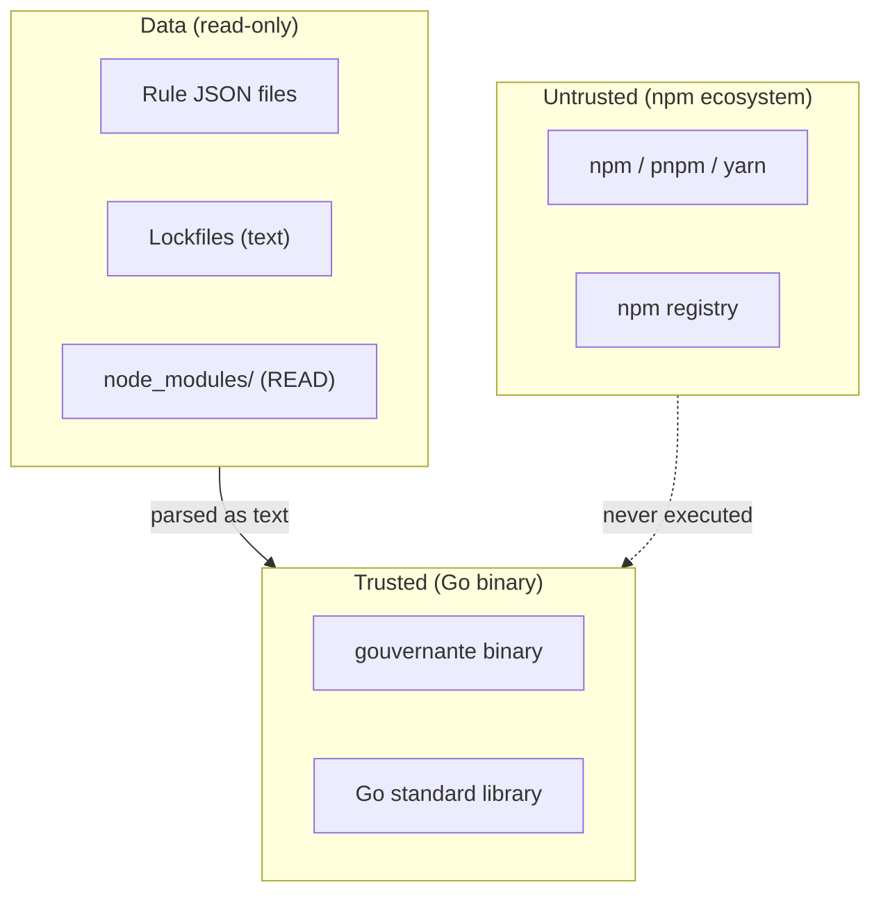
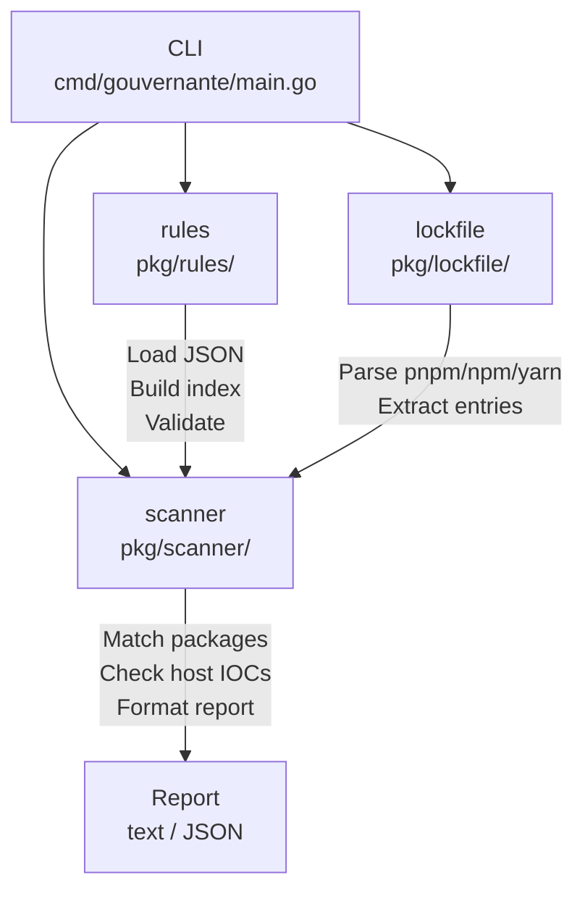
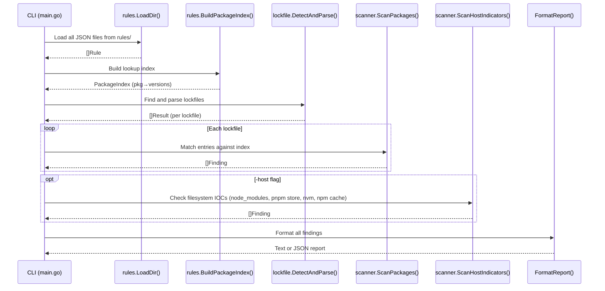

---
tags:
  - architecture
  - overview
  - security
---

# Architecture Overview

!!! abstract "TL;DR"

    - gouvernante is a **single static Go binary** with **zero npm ecosystem dependencies**.
    - It reads lockfiles as plain text, matches against a **JSON rule index**, and optionally checks host IOCs.
    - Rules are data, not code — new incidents are handled by writing a JSON file, not modifying the binary.
    - The scanner never executes JavaScript or invokes `node`. It reads `node_modules` to detect compromised packages.

!!! tip "Who is this for?"

    **Audience:** All — developers, operators, and anyone who wants to understand the tool.
    **Reading time:** ~10 minutes.

## Design Principles

### No npm Ecosystem Dependencies

The scanner must not execute JavaScript or depend on any npm package. A compromised
Node.js toolchain cannot be trusted to scan itself. gouvernante is a Go binary that
reads lockfiles as structured text using the Go standard library and minimal dependencies (goccy/go-yaml for pnpm).

### Rules Are Data, Not Code

New incidents are handled by writing a JSON rule file, not by modifying the scanner.
The response time for a new attack is limited by how fast you can write a JSON file,
not by a software release cycle.

### Single Static Binary

No runtime dependencies, no interpreters, no package managers. Copy the binary and
the rules directory to any machine and run it.

### Lockfiles Are Parsed, Not Executed

Lockfiles are read as data using Go-native parsers. pnpm-lock.yaml is parsed with
`goccy/go-yaml`, package-lock.json uses Go's `encoding/json`, and yarn.lock uses
a line scanner. No lockfile is ever evaluated or passed to `node`/`npm`/`pnpm`.

## Trust Boundaries

The scanner operates entirely outside the npm ecosystem. Nothing from npm is ever executed.



| Boundary | What crosses it | How |
|----------|----------------|-----|
| Rule files → scanner | JSON data | Parsed with `encoding/json`, no code execution |
| Lockfiles → scanner | Text/JSON | Parsed as structured text, never evaluated |
| node_modules → scanner | File metadata and package contents (READ) | Scanned for compromised packages, never executed |
| npm ecosystem → scanner | **Nothing executed** | The scanner never invokes `node`, `npm`, or any JavaScript |
| Host indicator checks | `os.Stat()` only | Never reads file contents, never executes files |

The binary has minimal, vetted external dependencies (`goccy/go-yaml` for YAML parsing). The scanning and matching engine uses only the Go standard library. See the [Minimal Dependencies](../reference/decision-log/minimal-dependencies.md) decision record for the full dependency policy.

## Component Diagram



## Package Layout

```
gouvernante/
├── cmd/gouvernante/          CLI entry point
│   └── main.go              Flag parsing, orchestration, output
├── pkg/
│   ├── rules/               Rule loading, indexing, and validation
│   │   ├── rules.go         JSON structs, LoadFile, LoadDir, BuildPackageIndex
│   │   └── validate.go      RuleSet.Validate() — enforces all schema constraints in Go
│   ├── lockfile/            Lockfile parsers
│   │   ├── types.go         PackageEntry, Result types
│   │   ├── detect.go        Auto-detection and dispatch
│   │   ├── pnpm.go          pnpm-lock.yaml parser (goccy/go-yaml)
│   │   ├── npm.go           package-lock.json parser (encoding/json)
│   │   └── yarn.go          yarn.lock parser (line scanner)
│   └── scanner/             Matching engine and output
│       └── scanner.go       ScanPackages, ScanHostIndicators, FormatReport
└── testdata/                Test fixtures
    ├── rules/               Rule fixtures (valid, invalid, incident samples)
    │   └── schema.json      JSON Schema for rule validation
    ├── pnpm-lock.yaml       Lockfile fixtures
    └── package-lock.json
```

## Data Flow



1. **Load rules.** `rules.LoadDir()` reads all JSON files, unmarshals into `RuleSet` structs, merges all rules.
2. **Build index.** `rules.BuildPackageIndex()` builds a `map[string][]*VersionSet` keyed by package name. Each package may have multiple `VersionSet` entries (one per rule/package\_rules entry) holding exact versions, semver range constraints, or an `AnyVersion` wildcard.
3. **Parse lockfiles.** `lockfile.DetectAndParse()` probes for known lockfile names (including `package.json`), parses each, returns per-lockfile entry lists.
4. **Scan packages.** For each lockfile, `scanner.ScanPackages()` checks every entry against the index. Matches produce `Finding` structs.
5. **Scan host indicators.** If enabled, scans filesystem locations (node_modules, pnpm store, nvm, npm cache) for IOC artifacts defined in rules.
6. **Output.** Formatted as text or JSON, written to stdout or file.

## Version Matching

| Format | Example | Behavior |
|--------|---------|----------|
| Exact | `=1.7.8` | Matches only version 1.7.8 |
| Bare | `1.7.8` | Same as `=1.7.8` |
| Wildcard | `*` | Matches any version |
| Semver range | `>=1.0.0 <2.0.0` | Matches versions satisfying the constraint (via Masterminds/semver v3) |
| Caret | `^1.7.0` | Matches compatible versions (same major) |
| Tilde | `~1.7.0` | Matches patch-level versions (same major.minor) |

## Lockfile Parser Design

Each parser uses the simplest approach that handles the format reliably:

| Parser | Strategy | Formats |
|--------|----------|---------|
| **pnpm** | `goccy/go-yaml` struct unmarshal + key parsing | v6 (`/pkg/ver`), v7-v8 (`/pkg@ver`), v9 (`pkg@ver`), peer suffixes |
| **npm** | `encoding/json` unmarshal | v1 (nested deps), v2/v3 (flat packages map) |
| **yarn** | Line scanner, header parsing | v1 classic |
| **package.json** | `encoding/json` unmarshal | `dependencies` and `devDependencies` (pinned versions match directly; range expressions checked against compromised versions) |

---

!!! question "Check your understanding"

    - [ ] Can you explain why the scanner uses goccy/go-yaml only for pnpm and the standard library for everything else?
    - [ ] Can you trace the path from a rule JSON file to a finding in the report?
    - [ ] Can you name the four lockfile formats (including package.json) and their parser strategies?
    - [ ] Can you explain what crosses each trust boundary?

## Next Steps

- [Rule Format](rule-format.md) — the canonical JSON rule specification
- [Decision Log](../reference/decision-log/index.md) — why these technologies were chosen
- [Writing Rules](../developer-guide/writing-rules.md) — how to author a new rule
