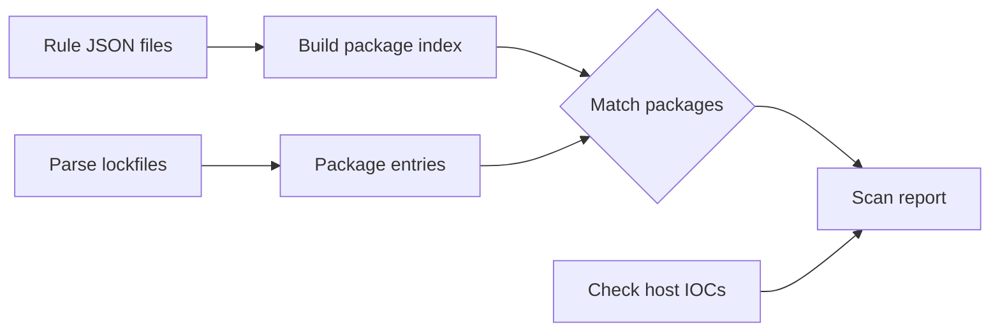

---
tags:
  - getting-started
  - quickstart
---

# Quickstart

!!! tldr "TL;DR"

    - gouvernante scans npm lockfiles for known compromised packages.
    - It checks `pnpm-lock.yaml`, `package-lock.json`, and `yarn.lock`.
    - Rules are JSON files — one per incident — stored in a rules directory.
    - Optionally checks the host filesystem for IOC artifacts (RAT binaries, exfil dumps).

!!! tip "Who is this for?"

    **Audience:** Anyone new to gouvernante.
    **Reading time:** ~5 minutes.

---

## What problem does this solve?

npm supply chain attacks are becoming routine. When a new attack hits (compromised
package release, mass typosquat campaign, dropper injection), you need to check
every project in your organization immediately.

Existing tools have gaps:

- **npm audit** lags behind zero-day incidents by hours or days.
- **Grype / Trivy** are advisory-driven — they need a CVE to exist first.
- **Running Node.js** to detect a Node.js supply chain attack is self-defeating — the toolchain may itself be compromised.

gouvernante fills this gap: a static Go binary, driven by JSON rules you control, that reads lockfiles as plain text and checks the host filesystem for known artifacts.

## How it works



1. **Load rules** from a directory of JSON files.
2. **Build an index** of compromised package+version pairs.
3. **Parse lockfiles** in the target directory (pnpm, npm, yarn).
4. **Match** every resolved package against the index.
5. **Optionally check** the host filesystem for IOC artifacts.
6. **Output** a text or JSON report.

## Key concepts

| Concept | Description |
|---------|-------------|
| **Rule** | A JSON object describing one supply chain incident — affected packages, dropper packages, host IOCs, and remediation guidance. |
| **Package rule** | A package name + affected version list within a rule. Versions use npm semver syntax. |
| **Dropper package** | An auxiliary package installed by the attack (e.g., `plain-crypto-js` in the axios incident). Any version is suspicious. |
| **Host indicator** | A filesystem artifact left by the compromise — malware binaries, exfiltration dumps, hidden directories. |
| **IOC** | Indicator of Compromise. A forensic artifact that indicates a system has been compromised. Host indicators are IOCs. |

## Your first scan

### Build

```bash
make build
```

### Scan a project

Point the scanner at your project directory. It auto-detects lockfiles:

```bash
./gouvernante -rules ./rules -dir /path/to/your/project
```

### Read the report

A clean scan:

```
=== Supply Chain Scan Report ===

Lockfiles scanned: pnpm-lock.yaml
Total packages analyzed: 847
Findings: 0

No compromised packages or host indicators found.
```

A scan with findings:

```
=== Supply Chain Scan Report ===

Lockfiles scanned: pnpm-lock.yaml
Total packages analyzed: 847
Findings: 2

--- Finding 1 ---
  Rule:     SSC-2025-001
  Title:    Axios compromised releases with RAT dropper
  Severity: critical
  Type:     package
  Package:  axios@1.7.8
  Lockfile: pnpm-lock.yaml

--- Finding 2 ---
  Rule:     SSC-2025-001
  Title:    Axios compromised releases with RAT dropper
  Severity: critical
  Type:     package
  Package:  plain-crypto-js@1.0.0
  Lockfile: pnpm-lock.yaml
```

### Add host indicator checks

```bash
./gouvernante -rules ./rules -dir /path/to/project -host
```

### JSON output for CI/CD

```bash
./gouvernante -rules ./rules -dir /path/to/project -json
```

### Exit codes

| Code | Meaning |
|------|---------|
| `0` | No findings — clean |
| `1` | Error (bad arguments, parse failure) |
| `2` | Findings detected — compromised packages or IOCs found |

---

## Self-Assessment

- [ ] Can you explain why gouvernante is a Go binary and not a Node.js tool?
- [ ] Can you scan a real project and get a report?
- [ ] Can you describe the difference between a package rule and a host indicator?

## Next Steps

- **Understand the internals** → [Architecture Overview](../architecture/overview.md)
- **Write a rule** → [Writing Rules](../developer-guide/writing-rules.md)
- **Integrate into CI/CD** → [CI/CD Integration](../operations-guide/ci-cd-integration.md)
- **All CLI flags** → [Running Scans](../operations-guide/running-scans.md)
